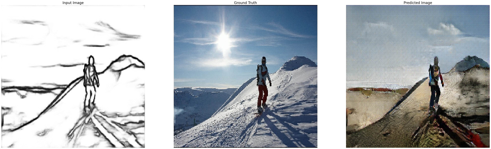
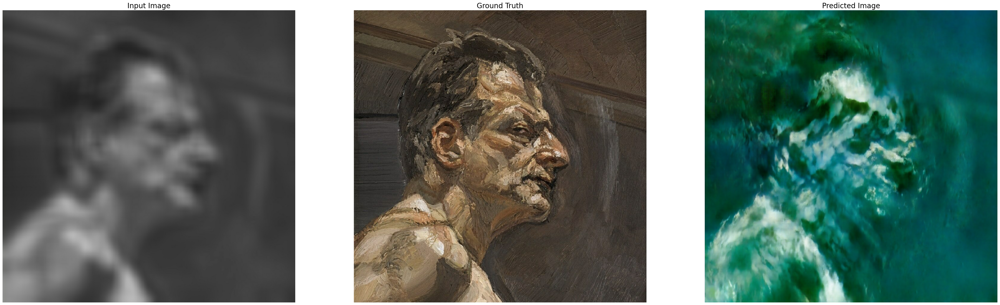

# pix2pix-live

## Description

Implementation of the Pix2Pix GAN for Image-to-Image Translation using tensorflow.

Pix2Pix is a Generative Adversarial Network, or GAN, model designed for general purpose image-to-image translation.

The approach was presented by Phillip Isola, et al. in their 2016 paper titled “Image-to-Image Translation with Conditional Adversarial Networks” and presented at CVPR in 2017.

The Pix2Pix GAN was demonstrated on a range of interesting image-to-image translation tasks. Have a look at the paper's [website](https://phillipi.github.io/pix2pix/).

## Objectives

From the perspective of the implementation:

* understand the algorithm intimately and discover parameter configurations.
* how the parameters of the algorithm influence its performance.
* experiment with various datasets and see the behaviour of the algorithm.
* how the preprocessing of the dataset affects the outcome.

Beyond the part of implementation, I was able to experiment and study the intersection of machine learning, Artificial Intelligence in general and Art.

## Getting Started

### Dependencies

For installing the dependencies from the `requirements.txt` file:
```
pip install -r requirements.txt 
```

* If you have Anaconda the installation of tensorflow and the rest of dependencies is often quite straight forward since most them are included.

* Tested only on Ubuntu 20.04, but should work on other platforms, as well.

* Highly suggesting the use of GPU.


### Installing

No action required other than the installation of the dependencies

### Executing program

Dataset
* Place the images for train and test in the corresponding folders in `Dataset/`.
  * Each image in the dataset should include in the same file Input and Ground Truth images, mostly for better performance and simplicity.
  * As previously tested, you could train the model from the outline of objects. For that purpose you could use `hed/batch_hed.py` to create the outlines of images using a Holistically-Nested Edge Detection model. Another way is to train using blurred images as an input.

Train
* Train the model by running the `pix2pix/train.py` file.
  * Various model parameters can be changed in the `pix2pix/params.py`.
  * Model checkpoints are saved per eporch in `pix2pix/training_checkpoints`.
  
Test
* Test the model by running either one of the following 
  * `pix2pix/inference.py` for testing images from the disc, or 
  * `pix2pix/livedemo_hed.py` and `pix2pix/livedemo_blur.py` using frames of the webcam as input.

## Examples





## Author

George Hadjiantonis

## License

This project is licensed under the Apache-2.0 License - see the LICENSE.md file for details.

## References

* [Phillip Isola, et al., 2016](https://phillipi.github.io/pix2pix/)
* [Pix2Pix tensorflow tutorial](https://github.com/tensorflow/docs/blob/master/site/en/tutorials/generative/pix2pix.ipynb)
* [A Gentle Introduction to Pix2Pix Generative Adversarial Network](https://machinelearningmastery.com/a-gentle-introduction-to-pix2pix-generative-adversarial-network/)
* [Holistically-Nested Edge Detection using pretrained hed model(caffe)](https://github.com/ashukid/hed-edge-detector)
